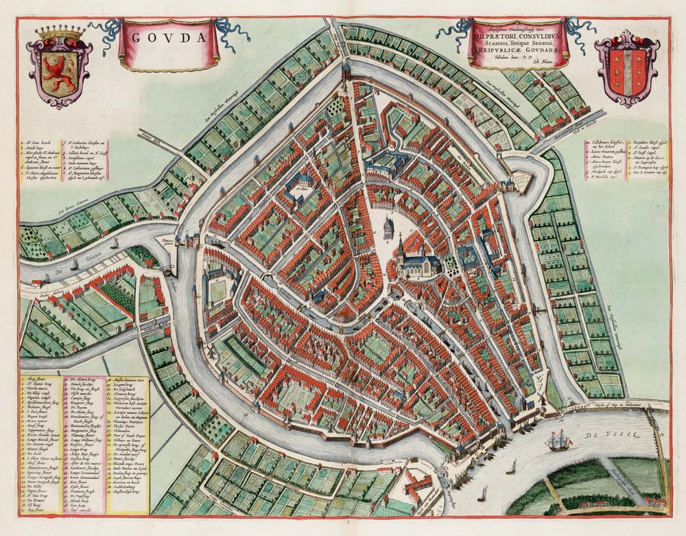
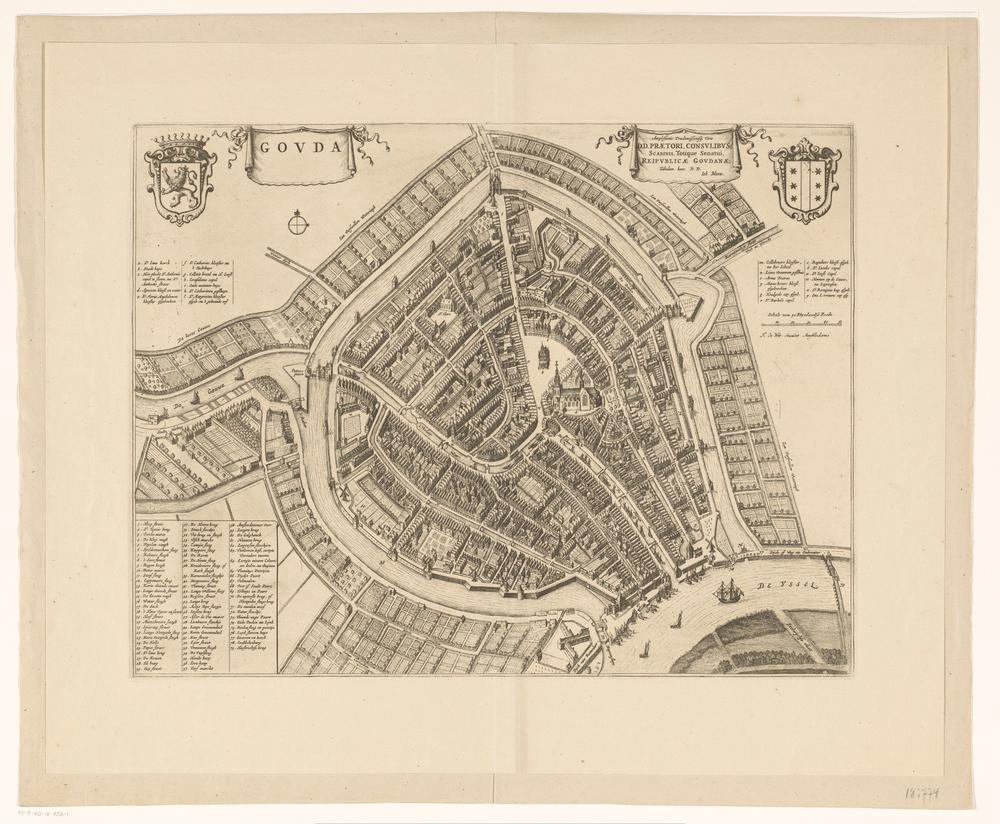
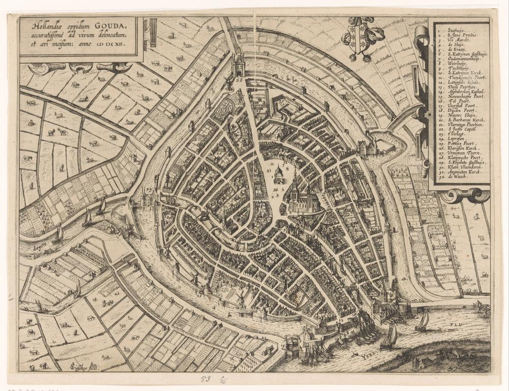

# Kaarten

## Plattegrond van Gouda door Joan Blaeu (1649)
* https://n2t.net/ark:/60537/bumH54  (of toch de 'monochrome' versie https://n2t.net/ark:/60537/bsunUJ ??)
* https://www.goudatijdmachine.nl/data/iiif/2/17782/manifest
* https://mapwarper.net/maps/68249 (https://mapwarper.net/maps/tile/68249/{z}/{x}/{y}.png)

 

of toch de 'monochrome' versie?

* https://n2t.net/ark:/60537/bsunUJ 
* https://www.goudatijdmachine.nl/data/iiif/2/155/manifest
* https://mapwarper.net/maps/68249 (https://mapwarper.net/maps/tile/68355/{z}/{x}/{y}.png)

 

## Hollandiae oppidum Gouda, accuratissimé ad vivum delineatum, et aeri incisum (1612 - 1648)
* https://n2t.net/ark:/60537/bIizeM
* https://www.goudatijdmachine.nl/data/iiif/2/151/manifest
* https://mapwarper.net/maps/68259 (https://mapwarper.net/maps/tile/68259/{z}/{x}/{y}.png)

 
