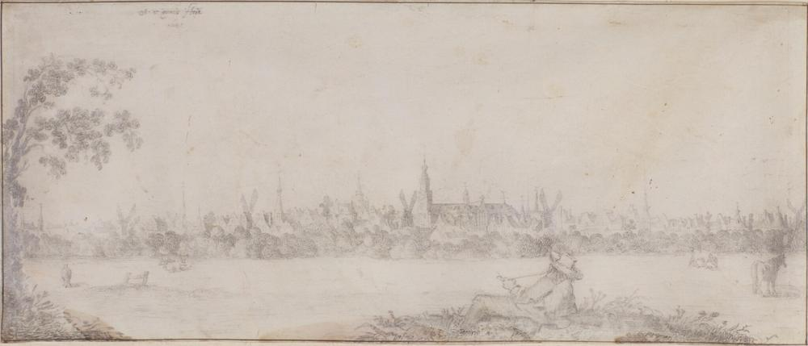
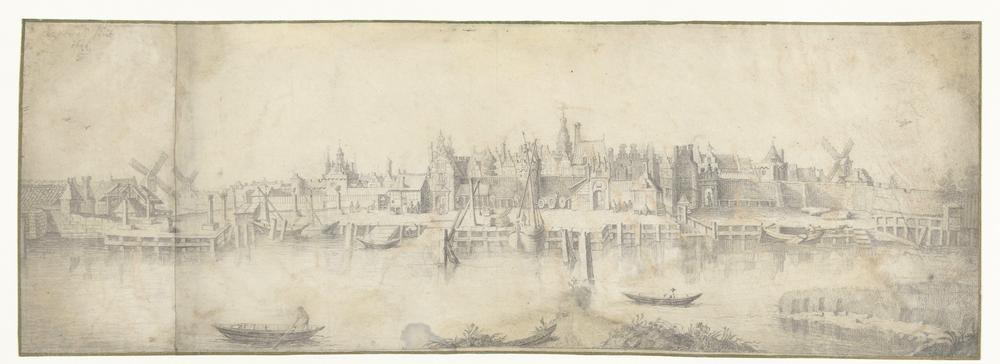

# Panorama's

## Gezicht op Gouda met op de voorgrond een pijp rokende man (1641)
* https://n2t.net/ark:/60537/bMtDIF
* https://www.goudatijdmachine.nl/data/iiif/2/93731/manifest
* https://rkd.nl/explore/images/305233
* Hulpmiddel: [rechthoeken tekenen en GeoJSON export](https://leaflet-iiif-geojson.glitch.me/?manifest=https://www.goudatijdmachine.nl/data/iiif/2/93731/manifest)

## Gezicht op Gouda vanaf de overzijde van de Hollandse IJssel (1644)
* https://n2t.net/ark:/60537/bUodRv
* https://rkd.nl/explore/images/231532
* https://www.goudatijdmachine.nl/data/iiif/2/93729/manifest
* Hulpmiddel: [rechthoeken tekenen en GeoJSON export](https://leaflet-iiif-geojson.glitch.me/?manifest=https://www.goudatijdmachine.nl/data/iiif/2/93729/manifest)

